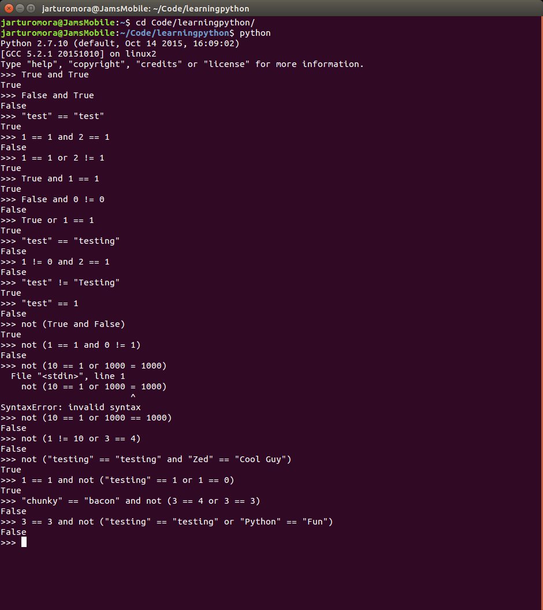

Solution for Excersice 28
-------------------------

## This is what I think

I solved this manually.

1. True and True <- True
2. False and True <- False
3. 1 == 1 and 2 == 1 <- False
4. "test" == "test" <- True
5. 1 == 1 or 2 != 1 <- True
6. True and 1 == 1 <- True
7. False and 0 != 0 <- False
8. True or 1 == 1 <- True
9. "test" == "testing" <- False
10. 1 != 0 and 2 == 1 <- False
11. "test" != "testing" <- True
12. "test" == 1 <- False
13. not (True and False) <- True
14. not (1 == 1 and 0 != 1) <- False
15. not (10 == 1 or 1000 == 1000) <- False
16. not (1 != 10 or 3 == 4) <- True
17. not ("testing" == "testing" and "Zed" == "Cool Guy") <- True
18. 1 == 1 and not ("testing" == 1 or 1 == 0) <- True
19. "chunky" == "bacon" and not (3 == 4 or 3 == 3) <- False
20. 3 == 3 and not ("testing" == "testing" or "Python" == "Fun") <- False

## This is what Python says

I wrote all the sentences in the Python console, and these were the results.

1. True and True <- True
2. False and True <- False
3. 1 == 1 and 2 == 1 <- False
4. "test" == "test" <- True
5. 1 == 1 or 2 != 1 <- True
6. True and 1 == 1 <- True
7. False and 0 != 0 <- False
8. True or 1 == 1 <- True
9. "test" == "testing" <- False
10. 1 != 0 and 2 == 1 <- False
11. "test" != "testing" <- True
12. "test" == 1 <- False
13. not (True and False) <- True
14. not (1 == 1 and 0 != 1) <- False
15. not (10 == 1 or 1000 == 1000) <- False
16. not (1 != 10 or 3 == 4) <- **False** # Ups! I failed in this **:-(**
17. not ("testing" == "testing" and "Zed" == "Cool Guy") <- True
18. 1 == 1 and not ("testing" == 1 or 1 == 0) <- True
19. "chunky" == "bacon" and not (3 == 4 or 3 == 3) <- False
20. 3 == 3 and not ("testing" == "testing" or "Python" == "Fun") <- False

## Results

I passed 19 of 20, I think this is not bad, bellow are the proof that I wrote
the sentences on the Python console. Even I commited a writting error sentence
15.

