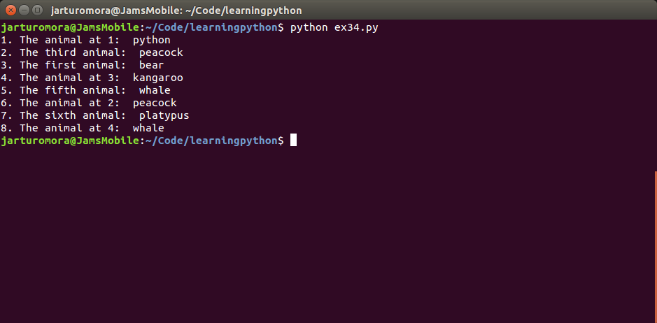

Extracting Elements from a List
-------------------------------

# The Manual Extraction
From the following list I wrotr the correct answer according to my python's
lists super powers.

```{python}
animals = ['bear', 'python', 'peacock', 'kangaroo', 'whale', 'platypus']
```

1. The animal at 1 <- python
2. The third animal <- peacok
3. The first animal <- bear
4. The animal at 3 <- kangaroo
5. The fifth animal <- whale
6. The animal at 2 <- peacock
7. The sixth animal <- platypus
8. The animal at 4 <- whale

# The Python Way

Now let's corroborate my manual results versus python.

```{python}
animals = ['bear', 'python', 'peacock', 'kangaroo', 'whale', 'platypus']

print "1. The animal at 1: ", animals[1]
print "2. The third animal: ", animals[2]
print "3. The first animal: ", animals[0]
print "4. The animal at 3: ", animals[3]
print "5. The fifth animal: ", animals[4]
print "6. The animal at 2: ", animals[2]
print "7. The sixth animal: ", animals[5]
print "8. The animal at 4: ", animals[4]
```

As you can see at the image bellow, I got the correct answers :-)
